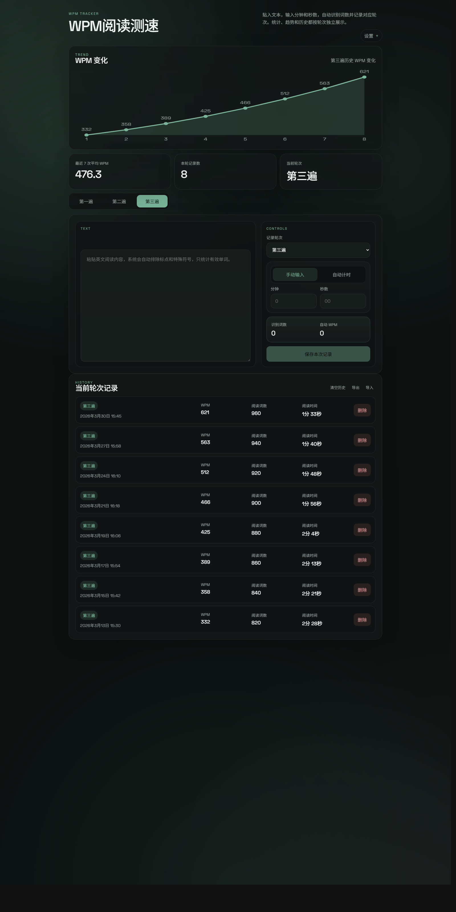

<div align="center">

# WPM阅读测速

一个为英语阅读训练设计的极简 WPM 工具。  
它不只计算一次速度，更关注趋势、轮次差异、历史记录和离线使用体验。

[界面预览](#界面预览) · [功能](#功能) · [使用方式](#使用方式) · [离线安装](#离线安装) · [技术实现](#技术实现)

</div>

## 界面预览

| 首页趋势与结果区 | 输入与历史记录 |
| --- | --- |
|  |  |

## 项目定位

大多数 WPM 工具只回答一个问题: 这次读得有多快。  
这个项目更关心另外三件事:

- 最近是不是在持续变快
- 不同轮次之间差距有多大
- 用户是否愿意长期打开它、持续记录

所以它的核心不是“测速页”，而是一个结果优先的阅读训练面板。

## 功能

### 结果优先

页面第一视觉区就是趋势图和关键数据，而不是输入框。打开后先看结果，再开始记录。

### 轮次独立统计

默认支持 `第一轮 / 第二轮 / 第三轮`，可扩展到最多 `第六轮`。  
每一轮的趋势图、最近 7 次平均 WPM 和历史记录都分开统计。

### 自动识别词数

粘贴英文文本后自动识别词数，并尽量排除标点与常见特殊符号。  
像 `don't`、`long-term` 这类词会尽量按一个词处理。

### 双时间录入

- 手动输入分钟 / 秒数
- 自动计时开始 / 暂停 / 重置

系统会自动计算 WPM，减少手动换算。

### 历史记录系统

- 单条删除
- 撤销最近一次删除
- 清空历史
- 回收站恢复
- 回收站清空
- JSON 导出 / 导入

### 主题系统

- 亮色 / 暗色模式
- 8 种克制的高级感主题色

主题会统一影响趋势图、卡片、状态和整体界面氛围，而不只是按钮换色。

### PWA 支持

- 可安装到桌面或主屏
- 可离线使用
- 已安装用户可收到新版本更新提示

## 一眼看懂

| 模块 | 说明 |
| --- | --- |
| 趋势图 | 展示当前轮次的 WPM 变化 |
| 最近 7 次平均 | 快速判断近期水平 |
| 轮次系统 | 最多支持 6 轮，独立统计 |
| 历史记录 | 支持删除、撤销、清空与回收站 |
| 备份 | 支持 JSON 导入 / 导出 |
| 主题 | 亮暗模式 + 8 种主题色 |
| PWA | 可安装、可离线、可提示更新 |

## 使用方式

### 1. 粘贴文本

把英文阅读内容粘贴到 `Text` 区域。

### 2. 选择轮次

默认有前三轮，也可以继续新增到第六轮。

### 3. 输入时间

你可以:

- 手动填写分钟和秒数
- 或直接使用自动计时

### 4. 保存记录

保存后页面会自动更新:

- 当前轮次趋势图
- 最近 7 次平均 WPM
- 本轮记录数
- 历史记录列表

## 首次打开

首次打开时会自动带一组示例数据，用来展示趋势图和完整界面效果。  
如果要开始记录自己的数据，删除示例记录或直接清空历史即可。

## 数据保存

当前版本使用浏览器 `localStorage` 保存数据。

优点:

- 刷新不会丢
- 关闭浏览器后通常仍保留
- 安装成离线版后也能继续使用

限制:

- 不自动跨设备同步
- 不自动跨浏览器同步
- 清除站点数据后会丢失

如果需要迁移或备份，请使用导出 / 导入功能。

## 离线安装

1. 打开网页
2. 进入右上角设置
3. 点击 `安装离线版`

安装后可以:

- 像本地应用一样打开
- 离线继续使用
- 保留当前设备上的本地记录

如果已经安装，检测到新版本后会出现轻量更新提示，点击即可刷新到最新版。

## 在线体验

把这里替换成你的正式地址即可:

```text
https://your-site.pages.dev
```

## 项目结构

- [index.html](./index.html)
- [styles.css](./styles.css)
- [script.js](./script.js)
- [manifest.json](./manifest.json)
- [sw.js](./sw.js)

## 技术实现

- 原生 HTML / CSS / JavaScript
- CSS 变量驱动主题系统
- `localStorage` 本地持久化
- `service worker` 离线缓存
- PWA 安装与更新提示

## 本地运行

因为项目包含 `service worker`，建议通过静态服务器运行，而不是直接双击 `index.html`。

```bash
npx serve .
```

## 后续方向

- 趋势图悬停详情
- 更细的词数统计规则
- 云端备份 / 多设备同步
- 用户系统

## License

如果准备长期公开维护，建议补一个明确许可证，例如:

- `MIT`
- `Apache-2.0`
