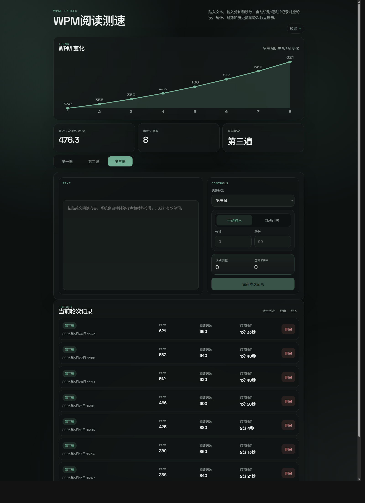

# WPM阅读测速

一个为英语阅读训练设计的极简 WPM 工具。

它不是“输个时间，给你一个数字”的普通测速页，而是一个更像产品的阅读表现面板：强调趋势、轮次差异、历史记录和离线使用体验。

## 这个项目的不同点

大多数 WPM 工具更像一次性计算器。

这个项目更关注三件事：

- 结果是否持续变好
- 第一遍、第二遍、第三遍之间差距有多大
- 用户是否愿意长期打开它、持续记录

所以它的设计重点不是堆功能，而是把下面这些体验做完整：

- 结果优先：打开页面先看到趋势图和关键数据
- 多轮次训练：第一遍 / 第二遍 / 第三遍分开统计
- 长期记录：支持历史、回收站、导入导出
- 本地工具感：支持主题系统、离线安装、桌面化使用

## 风格特点

这个工具的界面不是传统练习网站的“表单页面”，而是偏产品化、偏效率工具的方向。

关键词：

- 极简
- 克制
- 高级感
- 结果优先
- 柔和深色
- 轻产品感

它更像一个你愿意反复打开的个人训练面板，而不是一个学生作业式网页。

## 核心优势

### 1. 以趋势为中心，而不是一次性结果

页面第一视觉区就是 WPM 趋势图，不是输入框。

用户打开后先看到：

- 当前轮次趋势
- 最近 7 次平均 WPM
- 本轮记录数
- 当前轮次

这样更适合长期训练，也更容易感受到进步。

### 2. 第一遍 / 第二遍 / 第三遍分开统计

这是这个工具最实用的地方之一。

很多阅读训练的关键不是“我有多快”，而是：

- 第一遍有多慢
- 第二遍提升多少
- 第三遍能不能更稳定

这个项目把三轮次彻底拆开，趋势图、统计和历史都独立显示，不会混在一起。

### 3. 自动识别词数，降低录入摩擦

用户只需要粘贴英文文本，再输入时间或直接开始计时。

系统会自动：

- 识别词数
- 尽量排除标点和特殊符号
- 自动计算 WPM

比手动输入词数和速度更顺，也更不容易出错。

### 4. 真正可长期使用的历史系统

它不只是“记一下这次结果”，而是把记录管理也做好了：

- 单条删除
- 撤销删除
- 清空历史
- 回收站恢复
- 回收站彻底清空
- JSON 导出 / 导入

这让它更像真正能长期使用的数据工具，而不是一个临时页面。

### 5. 有完整主题系统，不只是换个按钮颜色

支持：

- 亮色 / 暗色模式
- 8 种克制的高级感主题色

主题会统一影响：

- 页面氛围
- 卡片层次
- 趋势图
- 选中态
- 设置面板

不是廉价彩虹色，而是偏现代、克制、产品化的配色。

### 6. 支持安装为离线版

这个项目已经支持 PWA。

用户可以直接把它安装到桌面或主屏，之后像本地工具一样打开，断网也能继续用。

这一点对“长期记录型工具”尤其重要。

## 适合谁

这个工具适合：

- 想训练英语阅读速度的人
- 想对比三轮阅读差异的人
- 想保留长期趋势的人
- 想用一个本地轻量工具，而不是复杂平台的人
- 想把工具安装到桌面或主屏的人

## 功能一览

- 自动识别英文词数
- 自动计算 WPM
- 手动输入时间
- 自动计时开始 / 暂停 / 重置
- 第一遍 / 第二遍 / 第三遍独立记录
- 最近 7 次平均 WPM
- 当前轮次趋势图
- 历史记录列表
- 删除 / 撤销删除
- 清空历史
- 回收站恢复
- 导出 / 导入 JSON
- 亮色 / 暗色模式
- 8 种主题色
- PWA 离线安装

## 使用流程

### 1. 粘贴文本

把英文阅读内容粘贴到 `Text` 区域。

### 2. 选择轮次

选择：

- 第一遍
- 第二遍
- 第三遍

### 3. 输入时间

可以任选一种方式：

- 手动输入分钟 / 秒数
- 使用自动计时

### 4. 保存记录

系统会自动计算 WPM，并更新：

- 趋势图
- 最近 7 次平均 WPM
- 本轮记录数
- 历史记录

## 首次打开时的示例数据

首次打开页面时，会自带一组示例记录。

目的不是替你伪造数据，而是：

- 让趋势图一打开就有内容
- 让页面结构更完整
- 让新用户能立刻理解这个工具是怎么工作的

如果你要开始记录自己的数据，只需要删除它们或直接清空历史。

## 数据保存方式

当前版本使用浏览器 `localStorage` 保存数据。

优点：

- 刷新不会丢
- 关闭浏览器后通常仍保留
- 离线安装后依然可用

限制：

- 不自动跨设备同步
- 不自动跨浏览器同步
- 清除站点数据后会丢失

所以如果你要迁移数据，建议使用导出 / 导入功能。

## 在线体验

你可以把这里替换成自己的正式地址：

```text
https://your-site.pages.dev
```

如果这个项目已经部署到 Cloudflare Pages，建议把真实链接直接写到这里，GitHub 首页转化会更高。

## 离线安装

支持安装为离线版。

使用方式：

1. 打开网页
2. 进入右上角设置
3. 点击 `安装离线版`

安装后可以：

- 像本地应用一样打开
- 离线继续使用
- 保留当前设备上的本地记录

## 截图建议

如果你希望 GitHub 首页更有吸引力，建议后续补这几张截图：

- 首页趋势图
- 输入与自动计时区域
- 主题系统
- 回收站 / 历史记录

示例：

```md



```

## 技术实现

这是一个纯前端静态项目，没有后端依赖。

主要文件：

- [index.html](./index.html)
- [styles.css](./styles.css)
- [script.js](./script.js)
- [manifest.json](./manifest.json)
- [sw.js](./sw.js)

技术特点：

- 原生 HTML / CSS / JavaScript
- CSS 变量驱动主题系统
- `localStorage` 本地持久化
- `service worker` 离线缓存
- PWA 安装支持

## 本地运行

因为项目包含 `service worker`，建议通过静态服务器运行，而不是直接双击 `index.html`。

例如：

```bash
npx serve .
```

## 后续可扩展方向

- 趋势图悬停详情
- 新版本更新提示
- 更细的词数统计规则
- 多设备同步
- 云端备份

## License

如果你准备继续公开维护，建议补一个明确许可证，例如：

- `MIT`
- `Apache-2.0`

否则 GitHub 访问者默认无法明确判断是否可以自由复用这个项目。
